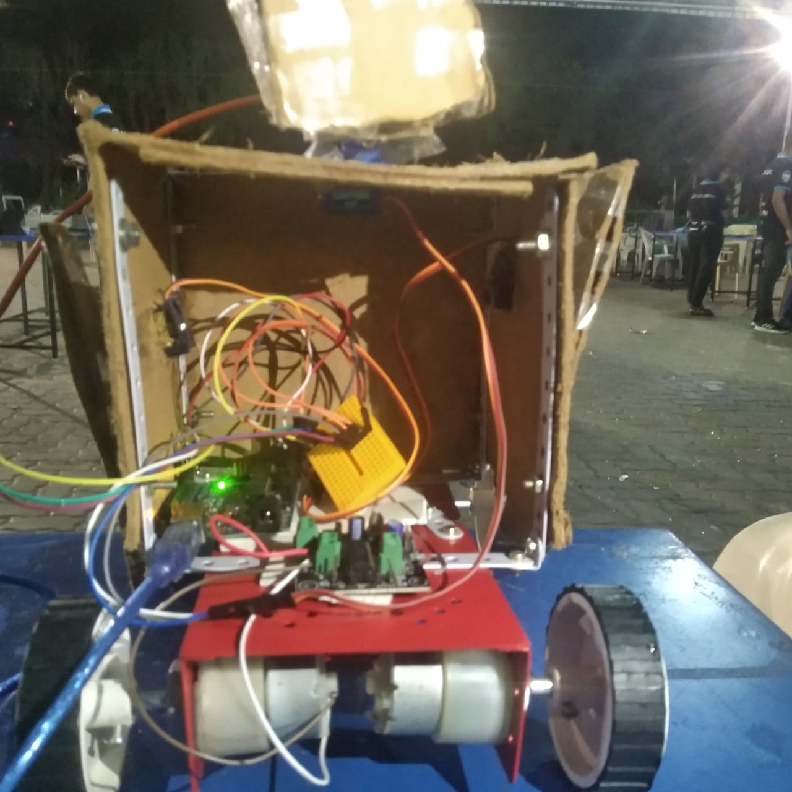
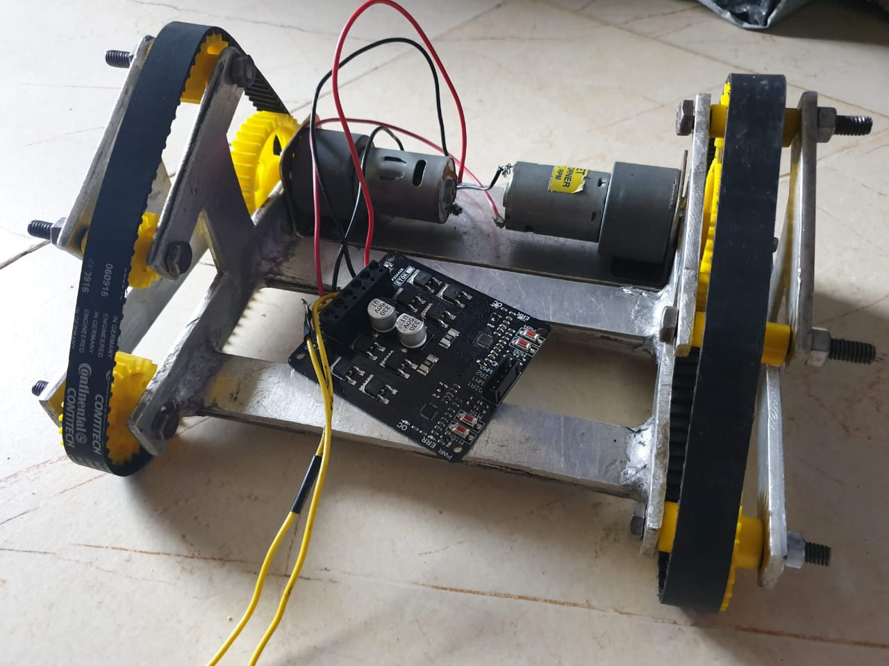
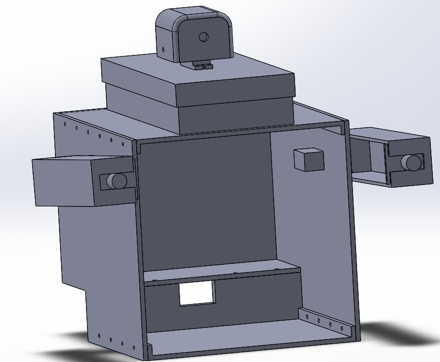

    

# The Cozmo Project

This is an interacting robot inspired from the movie "Wall E". This robot can recognize a face and greet you.
It can also track your face and carry out various commands given to it by using speech recognition.

The bot is controlled by a Raspberry Pi 3B+. The facial recognition and speech to text programs run on it and analysing the situation, it gives commands to the actuators via 2 Arduino UNOs connected to it.

## Images

## Made By:
* [Suyash Agarwal](https://github.com/suyashagarwal1902)
* [Pulkit Mahajan](https://github.com/pulkitmahajan23)
* [Hridik Kajaria](https://grabcad.com/hridik.kajaria-1/models)
